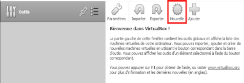
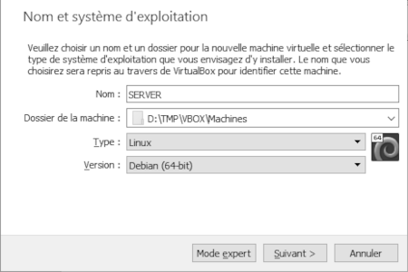
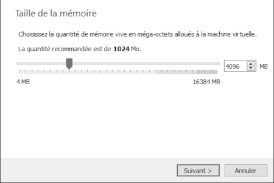
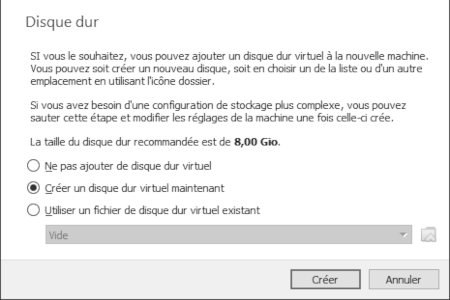
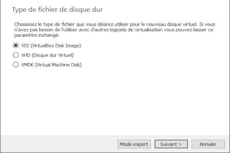
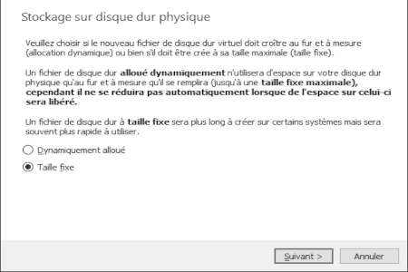
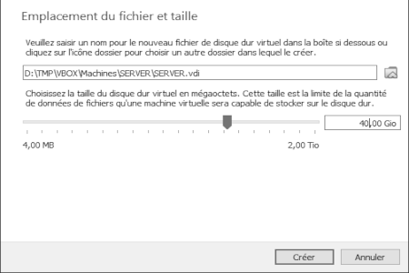
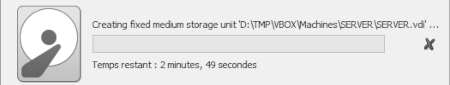

|             |             |               |
| :---        |    :----:   |          ---: |
| [Previous](02-vbox-config.md)     |-----------------------------------------------------------------------------------------------------------------------------| [Next](04-machine-config.md)   |
|             |             |               |

# MACHINE-CREATE  
  
___  

#### PRE-REQUIS:  
- Droits utilisateurs Windows 10  
___  

  
___  
  
___  
  
***La quantité de mémoire allouée sera modulable par la suite...***  
___  
  
***8Go c'est peut-être un peu léger...***  
___  
  
___  
  
___  
  
___  
  

|             |             |               |
| :---        |    :----:   |          ---: |
| [Previous](02-vbox-config.md)     |-----------------------------------------------------------------------------------------------------------------------------| [Next](04-machine-config.md)   |
|             |             |               |