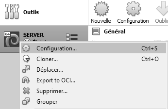
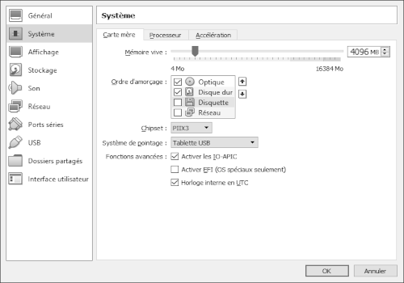
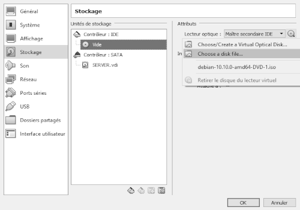
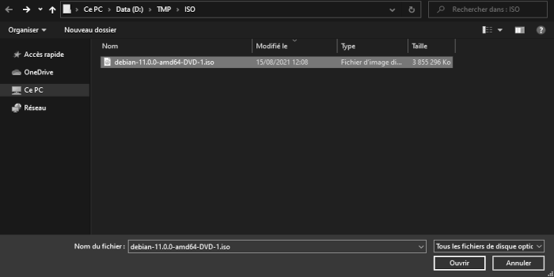
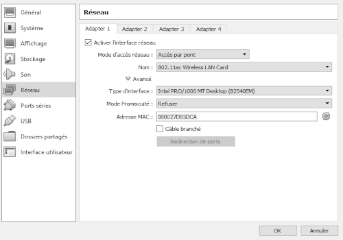

|             |             |               |
| :---        |    :----:   |          ---: |
| [Previous](03-machine-create.md)     |-----------------------------------------------------------------------------------------------------------------------------| [Next](05-debian-install.md)   |
|             |             |               |

# MACHINE-CONFIG  
  
___  

#### PRE-REQUIS:  
- Droits utilisateurs Windows 10  
- Download le 1er ISO-DVD de [Debian 11](https://cdimage.debian.org/debian-cd/current/amd64/iso-dvd/ "Debian 11")  
___  

  
___  
  
***Le lecteur de disquette est inutile...***  
___  
  
***On insére virtuellement l'iso dans le lecteur de la machine...***  
___  
  
___  
  
***Accés par pont & cable débranché pour le moment...***  

|             |             |               |
| :---        |    :----:   |          ---: |
| [Previous](03-machine-create.md)     |-----------------------------------------------------------------------------------------------------------------------------| [Next](05-debian-install.md)   |
|             |             |               |