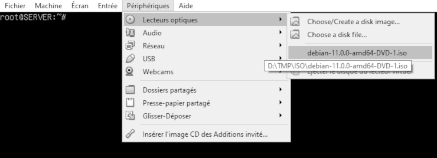
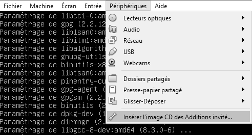
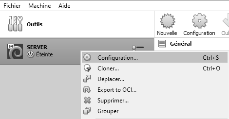
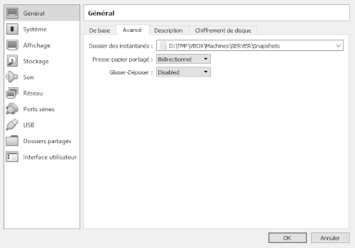
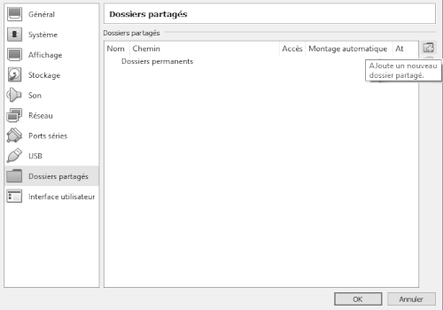
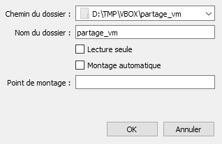
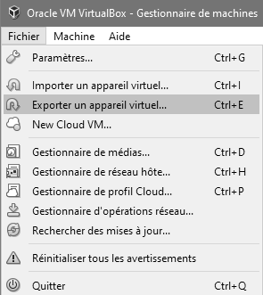

|             |             |               |
| :---        |    :----:   |          ---: |
| [Previous](05-debian-install.md)     |-----------------------------------------------------------------------------------------------------------------------------| [Next](07-debian-security.md)   |
|             |             |               |

#   DEBIAN-CONFIG
  
___

### Dependances
`su -`  
  
***Insérez l'ISO de Debian***  
`apt-get install -y dkms build-essential`  
`eject`
___

### Additions
***Cliquez sur :***  
  
___

***Si GUI (Interface Graphique)***  
***Patientez & fermez la pop-up qui s'affiche***  
`sh /media/cdrom0/VBoxLinux*.run`  
***Si no GUI***   
`mount /dev/sr0 /media/cdrom0`  
`sh /media/cdrom0/VBoxLinux*.run`  
`eject`  

### Dossiers partagés
***ATTENTION À BIEN REMPLACER USERNAME***❗❗❗  
`usermod -aG vboxsf USERNAME`  
`shutdown -h 0`  
 
___

  
***On en profite pour activer le copier-coller...***
___

  
***On peut maintenant ajouter un dossier à partager***
___

  
***Attention, juste nommer le partage (NOM_DOSSIER_PARTAGÉ_DANS_VIRTUALBOX) mais ne rien cocher***  
___

***On relance la VM***  
`mkdir ~/partage_vm`  
`su -`  
`nano /etc/fstab`

	NOM_DOSSIER_PARTAGÉ_DANS_VIRTUALBOX	/home/USERNAME/partage_vm	vboxsf	defaults	0	0
***Ajoutez la ligne, attention aux tabulations!***
___

###	Pensez à exporter!

|             |             |               |
| :---        |    :----:   |          ---: |
| [Previous](05-debian-install.md)     |-----------------------------------------------------------------------------------------------------------------------------| [Next](07-debian-security.md)   |
|             |             |               |

