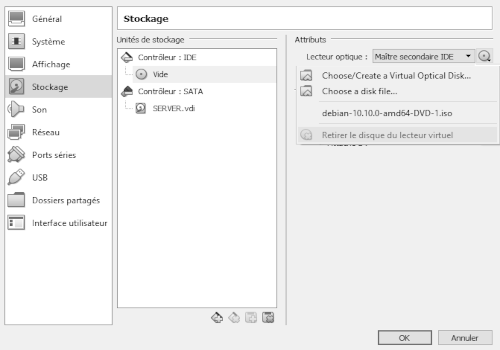
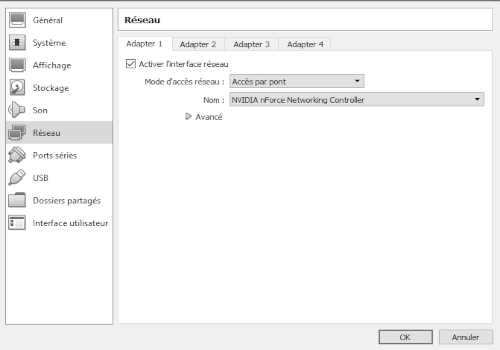

#   DEBIAN-CONFIG
  
___

## APT:
`su -`  

***Insérez l'ISO de Debian ou configurez une source mirroir***  
`nano /etc/apt/sources.list`  

***Commentez ou supprimez la ligne du CDROM Debian***  

    # deb cdrom:[...]
	deb http://deb.debian.org/debian/ buster main
	deb-src http://deb.debian.org/debian/ buster main
	deb http://security.debian.org/debian-security buster/updates main contrib
	deb-src http://security.debian.org/debian-security buster/updates main contrib
	deb http://deb.debian.org/debian/ buster-updates main contrib
	deb-src http://deb.debian.org/debian/ buster-updates main contrib
`apt-get update -y && apt-get dist-upgrade -y`   
`apt-get install -y dkms build-essential module-assistant`  
___

## ADDITIONS :
***Cliquez sur :***  
  
___
***Si GUI (Interface Graphique)***  
***Patientez & fermez la pop-up qui s'affiche***  
`sh /media/cdrom0/VBoxLinux*.run`  
***Si no GUI***  
`mkdir ~/cdrom0`  
`mount /dev/sr0 ~/cdrom0`  
`sh ~/cdrom0/VBoxLinux*.run`
___

## DOSSIER PARTAGÉ :
`usermod -aG vboxsf USERNAME`  
`shutdown -h 0`  
 
___

  
***On en profite pour activer le copier-coller...***
___
  
***...Retirer les additions aussi***
___
  
***...Passer en mode pont***
___
  
***On peut maintenant ajouter un dossier à partager***
___
  
***Attention, juste nommer le partage (NOM_DOSSIER_PARTAGÉ_DANS_VIRTUALBOX) mais ne rien cocher***  
___
***On relance la VM***  
`mkdir ~/partage_vm`  
`su -`  
`nano /etc/fstab`

	NOM_DOSSIER_PARTAGÉ_DANS_VIRTUALBOX	/home/USERNAME/partage_vm	vboxsf	defaults	0	0
***Ajoutez la ligne, attention aux tabulations!***