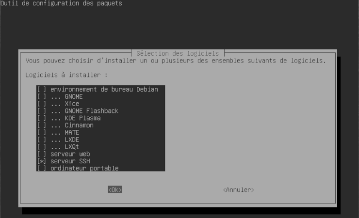
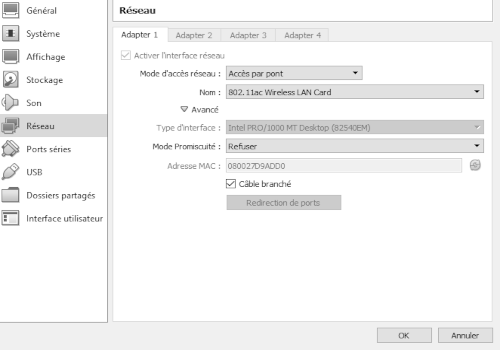

#   DEBIAN-SECURITY  
  
___  

### Fail2Ban & Network-Manager  
`su -`  
  
***Insérez l'ISO de Debian***  
`apt-get install -y fail2ban network-manager`  

### NFTABLES  
`cp -Rpv /etc/nftables.conf /etc/nftables.conf.ORI`  
`cp -Rpv /usr/share/doc/nftables/examples/workstation.nft /etc/nftables.conf`  
`nano /etc/nftables.conf`  

    #!/usr/sbin/nft -f

    flush ruleset

    table inet filter {
        chain input {
            type filter hook input priority 0;

            # accept any localhost traffic
            iif lo accept

            # accept traffic originated from us
            ct state established,related accept

            # activate the following line to accept common local services
            tcp dport { 22, 80, 443 } ct state new accept

            # accept neighbour discovery otherwise IPv6 connectivity breaks.
            # ip6 nexthdr icmpv6 icmpv6 type { nd-neighbor-solicit,  nd-router-advert, nd-neighbor-advert } accept

            icmp type echo-request accept

            # count and drop any other traffic
            counter drop
        }
    }

`systemctl enable nftables.service`  
`systemctl start nftables.service`  
`systemctl status nftables.service`  
`nft list ruleset`  
___  

### Sudo  
***ATTENTION À BIEN REMPLACER USERNAME IP-ADDRESS & PORT***❗❗❗  
`nano /etc/sudoers`  

    USERNAME ALL=(ALL:ALL) ALL

***On demande le mot de passe***  
🛑***OU INVERSEMENT***❗❗  

    USERNAME ALL=(ALL) NOPASSWD: ALL

`exit`  
`sudo touch toto.txt`  
`sudo rm toto.txt`  
***Voilà... ...USERNAME possède les droits...***  
__  

### SSHD  
`sudo tasksel`  
  
`sudo nano /etc/ssh/sshd_config`  

    Port PORT
    ChallengeResponseAuthentication no
    UsePAM yes
    X11Forwarding yes
    PrintMotd yes
    AcceptEnv LANG LC_*
    Subsystem       sftp    /usr/lib/openssh/sftp-server
    PermitRootLogin no
    AllowUsers USERNAME

***Préférez le port 22 car nftables bloque...***  
___  

### Fail2Ban  
`sudo nano /etc/fail2ban/jail.d/defaults-debian.conf`  

    [sshd]
    enabled = true
    banaction = nftables-multiport
    banaction_allports = nftables-allports

`sudo systemctrl restart fail2ban.service`  
`fail2ban-client status`  
___  

### APT  
`nano /etc/apt/sources.list`  

***Commentez ou supprimez la ligne du CDROM Debian***  

    # deb cdrom:[...]
	deb http://deb.debian.org/debian/ bullseye main
	deb-src http://deb.debian.org/debian/ bullseye main
	deb http://security.debian.org/debian-security bullseye-security main contrib
	deb-src http://security.debian.org/debian-security bullseye-security main contrib
	deb http://deb.debian.org/debian/ bullseye-updates main contrib
	deb-src http://deb.debian.org/debian/ bullseye-updates main contrib

___  

***On peut apparement rebrancher le câble....***  
  
`eject`  
`reboot`  
`sudo systemctl status fail2ban.service`  
`sudo systemctl status nftables.service`  
`ip a`  
___  

***On peut maintenant finir la config de SSH***  
### Connection SSH  
`mkdir .ssh`  
***Depuis la machine hôte***  
`ssh-keygen`  

!!! UNIX!!!  
`ssh-copy-id -pPORT <USERNAME>@<IP-ADDRESS>`  
!!! OU POWERSHELL !!! (utile pour autolog awec l'application Terminal de Windows 10)  
`scp.exe -PPORT .\.ssh\id_rsa.pub USERNAME@IP-ADDRESS:~/.ssh/authorized_keys`  
  
`ssh -pPORT <USERNAME>@<IP-ADDRESS>`  

***Retour sous Debian***  
`sudo nano /etc/ssh/sshd_config`  

    PasswordAuthentication no
    UsePAM no

`sudo systemctl restart sshd`  
___  

### UpDate!  
`nano ~/.upDate`  

    printf "\nBonjour! Nous somme le :\n"
    date
    uptime -p

    apt-get update -y
    apt-get dist-upgrade -y
    apt-get autoclean -y
    printf "\nUpdate! :)\n"

    exit 0

`chmod 100 .upDate`  
`sudo ~/.upDate`  
`sudo shutdown -h 0`  
___  

###	Pensez à exporter!  
  

[Next](08-debian-GUI.md)