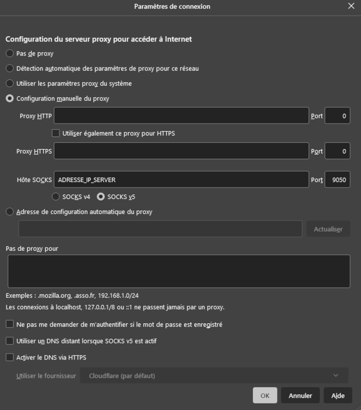

#   DEBIAN-TOOLS
  
___

##  TOOLS :
`sudo apt-get install -y emacs-nox git curl`

    git config --global user.name "USERNAME"
    git config --global user.email "EMAIL"
    git config --global color.ui auto
___

##  BASH :
`emacs -nw ~/.upDate`

    _IP=$(hostname -I) || true

    printf "\nYo! Nous somme le :\n"
    date
    uptime -p

    if [ "$_IP" ]; then
        printf "\nLocal IP Address : %s\n\n" "$_IP"
    fi

    sudo apt-get update -y
    sudo apt-get dist-upgrade -y
    sudo apt-get autoclean -y
    printf "\nUpdate! :)\n"

    exit 0
___

`emacs -nw  .bash_aliases`

    alias cls="clear;ls"
    alias clsa="clear;ls -lshaG"
    alias Rfresh="source ~/.bashrc"
    alias up="sudo sh ~/.upDate"
`source ~/.bashrc`
___

##  GNOME :
`sudo apt-get install -y gnome vlc`  
___

##  CODIUM :
`wget -qO - https://gitlab.com/paulcarroty/vscodium-deb-rpm-repo/raw/master/pub.gpg | gpg --dearmor | sudo dd of=/usr/share/keyrings/vscodium-archive-keyring.gpg`  

`echo 'deb [ signed-by=/usr/share/keyrings/vscodium-archive-keyring.gpg ] https://paulcarroty.gitlab.io/vscodium-deb-rpm-repo/debs vscodium main' | sudo tee /etc/apt/sources.list.d/vscodium.list`  

`sudo apt update`  
`sudo apt install codium`  
___

##  TOR : (optional)
`sudo apt-get install -y tor`  
`sudo systemctl status tor@default.service`  
`sudo emacs -nw  /etc/tor/torrc`

    SocksPort ADRESSE_IP_SERVER:9050
    SocksPolicy accept 192.168.0.0/16
    RunAsDaemon 1
    DataDirectory /var/lib/tor

`sudo systemctl restart tor@default.service`

  
***Paramètre dans Firefox de l'Host -> Paramètre réseau (tout en bas)***  