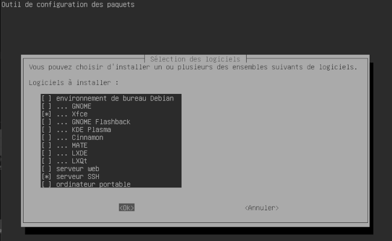

#   DEBIAN-TOOLS
  
___

###  Tools
`sudo apt-get install -y htop emacs-nox git curl fonts-recommended`

    git config --global user.name "USERNAME"
    git config --global user.email "EMAIL"
    git config --global color.ui auto
`ssh-keygen -t ed25519 -C "your_email@example.com"`  
`eval "$(ssh-agent -s)"`  
`ssh-add ~/.ssh/id_ed25519`   
`ssh -T git@github.com`  
***Et Collez le contenu sur GitHub.com... (.pub)***
___

###  Aliases
`emacs -nw  .bash_aliases`

    alias Rfresh="source ~/.bashrc"
    alias cls="clear;ls"
    alias clsa="clear;ls -lshaG"
    alias doc="cd ~/Documents/;clsa"
`source ~/.bashrc`
___

##  ⚠ OPTIONAL! ⚠
___
### GUI
`sudo tasksel`  
  
***Assez gourmand en ressource attention mais Xfce est un bon compromis...***  
***Au prochain boot pensez à up la machine si possible: nombre de processeurs, mémoire vidéo...***
___

### VLC
`sudo apt-get install -y vlc`  
___

###  Visual Studio Codium
`wget -qO - https://gitlab.com/paulcarroty/vscodium-deb-rpm-repo/raw/master/pub.gpg | gpg --dearmor | sudo dd of=/usr/share/keyrings/vscodium-archive-keyring.gpg`  

`echo 'deb [ signed-by=/usr/share/keyrings/vscodium-archive-keyring.gpg ] https://paulcarroty.gitlab.io/vscodium-deb-rpm-repo/debs vscodium main' | sudo tee /etc/apt/sources.list.d/vscodium.list`  

`sudo apt update`  
`sudo apt install codium`  
___

###  YouTube-Dl
`sudo apt-get install ffmpeg python3-pip`  
`sudo pip install youtube-dl`  
`sudo pip install --upgrade youtube-dl`  

`youtube-dl -F <lien yt>` # Affiche toutes les qualités dispo  
`youtube-dl -f137+251 <lien yt>` # Fusionne la video(137) avec le son (251)  
`youtube-dl -kf '(bestvideo+bestaudio/best)' <lien yt>` # Best Quality + no delete source -k
___

###  TOR
`sudo apt-get install -y tor`  
`sudo systemctl status tor@default.service`  
`sudo emacs -nw /etc/tor/torrc`

    SocksPort ADRESSE_IP_SERVER:PORT
    SocksPolicy accept 192.168.0.0/16
    RunAsDaemon 1
    DataDirectory /var/lib/tor

`sudo systemctl restart tor@default.service`  
***Pensez à update /etc/nftables.conf***  

  
***Paramètre dans Firefox de l'Host -> Paramètre réseau (tout en bas)***
___

###	Pensez à exporter!
