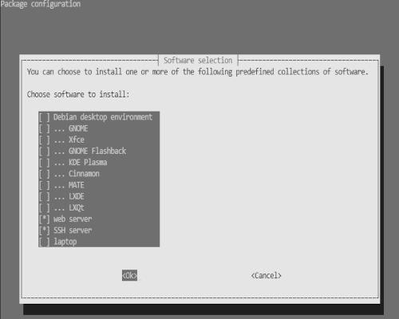
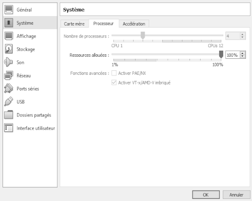

#   DEBIAN-WEB  
##  Tools  
`sudo apt-get install -y htop curl git`  
___  

## Git  
    git config --global user.name "USERNAME"
    git config --global user.email "EMAIL"
    git config --global color.ui auto

`ssh-keygen -t ed25519 -C "your_email@example.com"`  
`eval "$(ssh-agent -s)"`  
`ssh-add ~/.ssh/id_ed25519`  
`ssh -T git@github.com`  
***Et Collez le contenu sur GitHub.com... (.pub)***  
___  

##  NodeJS + Yarn  
`sudo apt-get update`  
`sudo apt-get install -y ca-certificates curl gnupg`  
`sudo mkdir -p /etc/apt/keyrings`  
`curl -fsSL https://deb.nodesource.com/gpgkey/nodesource-repo.gpg.key | sudo gpg --dearmor -o /etc/apt/keyrings/nodesource.gpg`  
`NODE_MAJOR=20`  
`echo "deb [signed-by=/etc/apt/keyrings/nodesource.gpg] https://deb.nodesource.com/node_$NODE_MAJOR.x nodistro main" | sudo tee /etc/apt/sources.list.d/nodesource.list`  
`sudo apt-get update`  
`sudo apt-get install nodejs -y`  
`sudo npm install --global yarn`  
___  

## Server Web  
`sudo tasksel`  
 ___  

___  

## PHP 8.2  
###    Install
`sudo apt-get -y install libapache2-mod-php8.2 mariadb-server mariadb-client librabbitmq-dev composer php8.2 php8.2-{apcu,amqp,bcmath,bz2,common,cli,curl,dev,fpm,gd,intl,mbstring,mysql,pgsql,opcache,readline,redis,xdebug,xml,yaml,zip}`  
___  
`sudo a2enmod proxy_fcgi setenvif`  
`sudo systemctl restart apache2`  
`sudo a2enconf php8.2-fpm`  
`sudo systemctl reload apache2`  
`sudo nano /etc/php/8.2/apache2/php.ini`  

    memory_limit = 512M
    display_errors = On
    post_max_size = 32M
    upload_max_filesize = 64M

`sudo systemctl restart apache2`  
___  

##  Apache 2  
`sudo nano /etc/apache2/sites-available/000-Adminer.conf`  

    Listen 8001
    <VirtualHost *:8001> 
        ServerAdmin USERNAME@localhost
        ServerName Adminer
        DocumentRoot /var/www/Adminer/public/
        <Directory /var/www/Adminer/public/>
            Options +Indexes +FollowSymLinks
            AllowOverride All
            Require all granted
        </Directory>
    </VirtualHost> 

`mkdir -p ~/Documents/Adminer/public`  
`sudo ln -s ~/Documents/Adminer /var/www/Adminer`  
`sudo a2ensite 000-Adminer.conf`  
`sudo systemctl reload apache2`  
`sudo a2enmod rewrite`  
`sudo systemctl restart apache2`  
___  

##  Adminer  
`cd ~/Documents/Adminer/public`  
`wget https://www.adminer.org/latest.php`  
`mv latest.php index.php`  
___  

## Mariadb  
`sudo mysql -u root -p -h localhost`  

    CREATE DATABASE projettest_db;
    GRANT ALL ON projettest_db .* TO 'YOUR_NICKNAME'@'localhost' identified by 'TEST1234' WITH GRANT OPTION;
    GRANT CREATE ON *.* to 'YOUR_NICKNAME'@'localhost';
    FLUSH PRIVILEGES;
    exit

`sudo systemctl restart mariadb.service`  
___  

##  NodeRED  
`bash <(curl -sL https://raw.githubusercontent.com/node-red/linux-installers/master/deb/update-nodejs-and-nodered)`  
`sudo systemctl start nodered.service`  
`sudo systemctl enable nodered.service`  
___  

## Symfony  
`curl -1sLf 'https://dl.cloudsmith.io/public/symfony/stable/setup.deb.sh' | sudo -E bash`  
`sudo apt-get install symfony-cli`  
`symfony check:requirements`  
___  

### Pensez à ajouter le port 8001 et ceux dont vous avez besoin dans iptables   
`sudo nano /etc/nftables.conf`  
___  

##	Pensez à exporter!  
`sudo shutdown -h 0`  
  
___  

##  Docker Engine
### Add Docker's official GPG key:
`sudo apt-get update`  
`sudo apt-get install ca-certificates curl gnupg`  
`sudo install -m 0755 -d /etc/apt/keyrings`  
`curl -fsSL https://download.docker.com/linux/debian/gpg | sudo gpg --dearmor -o /etc/apt/keyrings/docker.gpg`  
`sudo chmod a+r /etc/apt/keyrings/docker.gpg`  
`sudo docker run hello-world`  
### Add the repository to Apt sources:  
`echo "deb [arch="$(dpkg --print-architecture)" signed-by=/etc/apt/keyrings/docker.gpg] https://download.docker.com/linux/debian "$(. /etc/os-release && echo "$VERSION_CODENAME")" stable" | sudo tee /etc/apt/sources.list.d/docker.list > /dev/null`  
`sudo apt-get update`  
`sudo apt-get install docker-ce docker-ce-cli containerd.io docker-buildx-plugin docker-compose-plugin`  
### Activez la VT-X  
  
___  

 ###	Pensez à exporter!  
`sudo shutdown -h 0`  
  
___  

##  TOR  
`sudo apt-get install -y tor`  
`sudo systemctl status tor@default.service`  
`sudo nano /etc/tor/torrc`  

    SocksPort ADRESSE_IP_SERVER:PORT
    SocksPolicy accept 192.168.0.0/16
    RunAsDaemon 1
    DataDirectory /var/lib/tor

`sudo systemctl restart tor@default.service`  
***Pensez à update /etc/nftables.conf***  

  
***Paramètre dans Firefox de l'Host -> Paramètre réseau (tout en bas)***  
___  

##	Pensez à exporter!  
  

[Next](10-debian-fun.md)