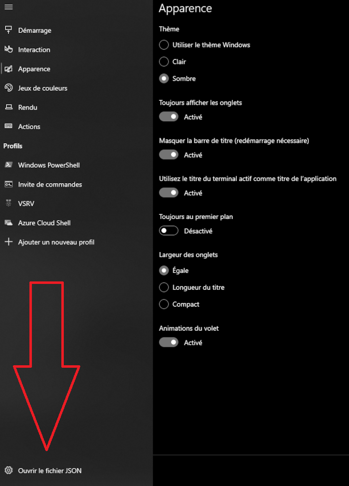
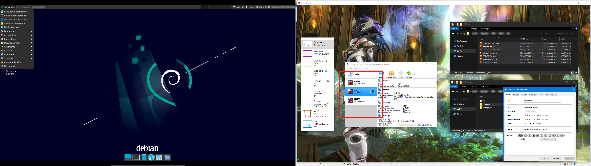

#   DEBIAN-FUN  
## Aliases  
`nano .bash_aliases`  

    alias Rfresh="source ~/.bashrc"
    alias cls="clear;ls"
    alias clsa="clear;ls -lshaG"
    alias doc="cd ~/Documents/;clsa"

`source ~/.bashrc`  
___  

##  YouTube-Dl  
`sudo apt-get install ffmpeg python3-pip`  
`sudo pip install youtube-dl`  
`sudo pip install --upgrade youtube-dl`  

`youtube-dl -F <lien yt>` # Affiche toutes les qualités dispo  
`youtube-dl -f137+251 <lien yt>` # Fusionne la video(137) avec le son (251)  
`youtube-dl -kf '(bestvideo+bestaudio/best)' <lien yt>` # Best Quality + no delete source -k  

## Hostname  
`sudo nano /etc/hostname`  
___  

## Welcome  
`sudo nano /etc/motd`  

    Bienvenue sur : 
    
     ##  ###  ##   # #  ###  ##    # 
    #    #    # #  # #  #    # #   # 
     #   ##   ##   # #  ##   ##    # 
      #  #    # #  # #  #    # #     
    ##   ###  # #   #   ###  # #   #                            

ou custom :)  
[https://github.com/ar51an/raspberrypi-motd/blob/main/README.md](https://github.com/ar51an/raspberrypi-motd/blob/main/README.md)   
___  

## Cmatrix  
`sudo apt-get -y install cmatrix`  
___  

## Terminal Windows 10  
***Installez l'application [Terminal](https://apps.microsoft.com/detail/9n0dx20hk701?hl=fr-fr&gl=FR) depuis le Store de Windows puis dans Paramètre***  

  

***'Ouvrir le fichier JSON'***  
***Ajoutez le bloc dans*** _profiles->list_  
***& remplacez les champs: guid, commandline, backgroundImage, icon***  

    {
        "guid": "{58ad8b0c-3ef4-5f4a-sc6f-43e789f2544}",
        "hidden": false,
        "name": "VSRV",                
        "commandline" : "ssh USERNAME@IP_VM",
        "acrylicOpacity" : 0.5,
        "backgroundImage" : "ms-appdata:///Roaming/1.jpg",
        "backgroundImageOpacity" : 0.15,
        "backgroundImageStretchMode" : "uniformToFill",
        "closeOnExit" : true,
        "colorScheme" : "Campbell",
        "cursorColor" : "#FFFFFF",
        "cursorShape" : "bar",
        "fontFace" : "Consolas",
        "fontSize" : 12,
        "historySize" : 9001,
        "icon" : "ms-appdata:///Roaming/pi.png",
        "padding" : "0, 0, 0, 0",
        "snapOnInput" : true,
        "startingDirectory" : "%USERPROFILE%/",
        "useAcrylic" : true 
    },

***Attention à backgroundImage & icon❗***  
***il correspond au dossier RoamingState situé un niveau au dessus de ce fichier JSON***  
***Si error d'SSH revoir la partie securité du tuto pour se connecter avec powershell...***  

***Voilà maintenant en un click vous êtes log! : )***  
___  

##  Et aussi n'hésitez pas à importer & créer vos variantes! : )  
